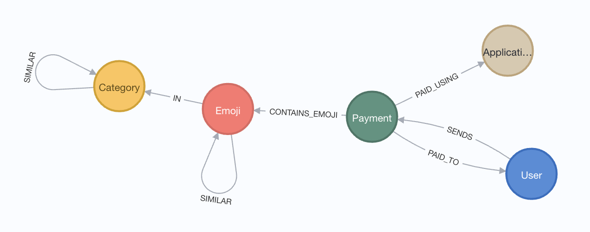

= Venmo and Emoji graph data set analysis

This project combines 2 data sets to analyze the use of emojis in Venmo payments notes.

== Creating a Neo4j database instance

There are a few options. Personal preference is to use Aura free or sandbox.

1. https://dev.neo4j.com/aura[Neo4j Aura free tier^]
2. https://dev.neo4j.com/sandbox[Neo4j Sandbox^]
3. https://dev.neo4j.com/desktop[Local instance^]

== Data set

Combination of the following data sets:

1. https://github.com/sa7mon/venmo-data[Venmo payments^]
2. https://github.com/moxious/emoji-graph[Emoji graph^]

Both data sets can be loaded using the `data-load.cypher` statements in this repository.

